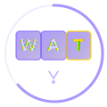
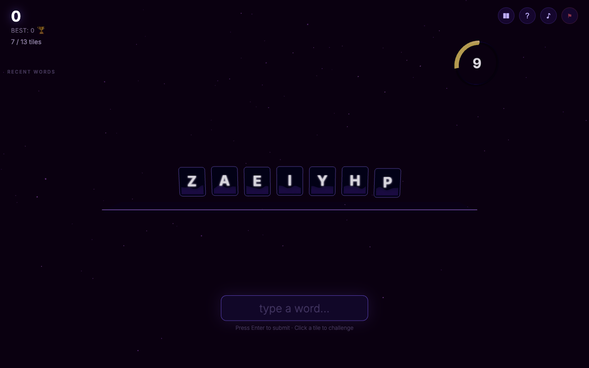

  

# Words Against Time

**A real-time WebGL word game delivered as a single HTML file.**

Letters pile up on a 30-second timer. Type words to clear tiles from your rack before it hits 13. Every second counts — and every word matters.

Built entirely with vanilla JavaScript, Three.js, and the Web Audio API. No frameworks, no build tools, no server required. Just open the file and play.

---

## :video_game: Play

**Open `index.bundled.html` in any modern browser.** That's it. Works from `file://`, no server needed.

---

## :gear: How It Works

1. You start with **7 letter tiles** on a 3D rack
2. A **30-second timer** counts down — when it hits zero, a new tile appears
3. **Type a word** and press Enter to consume matching tiles from your rack
4. If your rack reaches **13 tiles**, it's game over
5. **Clear all tiles** for a +100 point bonus and a fresh rack
6. **Click any tile** to challenge it in a speed mini-game

### Scoring

| Action | Points |
|--------|--------|
| Each rack tile used in a word | **10 pts** |
| Each extra letter (not on rack) | **1 pt** (distinct only) |
| Bonus letter (X, W, Z, Q, J) used | **+25 pts** on top of base |
| Board clear (all tiles gone) | **+100 pts** |

### The Challenge

Click a tile to challenge it. You get **15 seconds** to type **3 words** starting with that letter. Win and the tile is removed. Lose and it duplicates — plus a 15-point penalty.

---

## :sparkles: Technical Highlights

### Single-File Deliverable
The entire game — 3D renderer, game engine, audio system, 380K-word dictionary — ships as **one self-contained HTML file** (3.8 MB). No external assets, no API calls, no server dependencies.

### :art: 3D Rendering (Three.js r160)
- Flat tile panels with rounded corners matching the logo aesthetic
- Per-tile GLSL liquid shader that drains in sync with the timer
- Particle shatter effects on tile removal
- Responsive 3D timer ring that adapts to any viewport size
- Floating purple nebula background particles

### :speaker: Procedural Audio (Web Audio API)
Every sound is generated in real-time from oscillators and noise — zero audio files:
- Crystalline chimes for tile appearance
- Ascending arpeggios for accepted words
- Shimmer cascades for board clears
- Pulsing heartbeat when time runs low
- Grand fanfare for first-place finishes

### :books: 380K-Word Dictionary
Merged from four sources for maximum coverage:
1. macOS system dictionary
2. Webster's Second International
3. ENABLE (Enhanced North American Benchmark Lexicon)
4. dwyl/english-words

Includes standard English, common slang, proper nouns, brand names, and country names. Stored as a JavaScript `Set` for O(1) lookup. No network requests — the entire dictionary loads instantly from the HTML file.

### Game Polish
- **Auto-pause** on tab switch, window blur, or screen lock
- **Leaderboard** with top 10 scores persisted in localStorage
- **First-place celebration** with gold pulsing animation and fanfare
- **Word history** sidebar with color-coded letter scoring
- **Recent word ban** — last 5 words can't be reused
- **Responsive** — adapts from narrow mobile to ultrawide displays
- **Tutorial overlay** on first load with one-click start

---

## :wrench: Tech Stack

| Layer | Technology |
|-------|-----------|
| 3D Rendering | Three.js r160 (CDN) |
| Game Logic | Vanilla JavaScript |
| Audio | Web Audio API (procedural) |
| Styling | CSS3 with Inter font |
| Persistence | localStorage |
| Dictionary | 380K words, inline JavaScript Set |
| Delivery | Single HTML file (3.8 MB) |

**Zero frameworks. Zero build tools. Zero runtime dependencies beyond the Three.js CDN.**

---

## :trophy: Community Contest

This project was created with **Claude Opus 4.6** as part of the [Claude Code Community Hackathon](https://claudecode.community/hackathon).

---

## License

MIT
